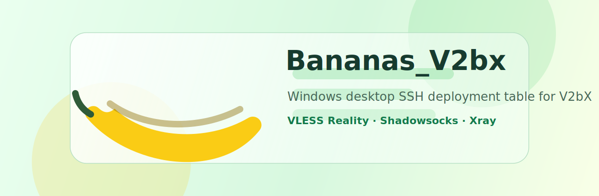

# Bananas_V2bx



**Windows 桌面版 V2bX SSH 快捷部署工具，基于 [wyx2685/V2bX](https://github.com/wyx2685/V2bX)，由 GPT-5.5 辅助梳理脚本流程与产品实现。**

[](https://www.python.org/)
[](https://www.microsoft.com/windows)
[](https://github.com/wyx2685/V2bX)
[](#)
[](#)

## 项目定位

Bananas_V2bx 是一个给 Windows 使用的桌面工具，用 SSH 密码连接单台 VPS，自动调用 V2bX 官方安装脚本和 `V2bX generate` 交互流程，减少手动在命令行里一步一步输入节点配置时出错的概率。

它不替代 V2bX，也不内置代理核心。它只做一件事：把你在表格里填好的节点，按 V2bX 脚本真实流程部署到 `/etc/V2bX/config.json`。

当前重点支持：

- 单台 Windows 电脑管理单台 VPS
- SSH 密码登录
- `xray` core
- `VLESS Reality`
- `Shadowsocks`
- 表格化节点列表：新增、删除选中、复制选中、清空列表
- 拉取远程配置后直接在列表里修改，不再使用右侧节点表单

## 下载和运行

可以直接从 [Releases](https://github.com/GoSim7/Bananas_V2bx/releases) 下载打包好的 `Bananas_V2bx.exe`。

本地开发运行：

```powershell
git clone https://github.com/GoSim7/Bananas_V2bx.git
cd Bananas_V2bx
python -m venv .venv
.\.venv\Scripts\pip install -r requirements.txt
.\run.bat
```

打包 exe：

```powershell
.\build.bat
```

输出文件：

```text
dist\Bananas_V2bx.exe
```

## 使用流程

```text
连接 / 测试 SSH
  -> 检测安装 或 安装/更新 V2bX
  -> 拉取配置
  -> 在节点表格里新增、复制或编辑节点
  -> 部署节点
  -> 查看输出日志里的部署后校验结果
```

表格字段：

| 字段 | 说明 |
|---|---|
| `ApiHost` | 面板地址，例如 `https://panel.example.com` |
| `ApiKey` | 面板 API Key |
| `NodeID` | 面板里的真实节点 ID |
| `NodeType` | 目前支持 `vless` 或 `shadowsocks` |
| `CertMode` | VLESS 自动使用 `reality`，Shadowsocks 自动使用 `none` |

其他字段使用固定默认值，例如 `ListenIP=0.0.0.0`、`SendIP=0.0.0.0`、`DNSType=UseIPv4`、`EnableUot=true`、`EnableTFO=true`、`CertDomain=example.com`。

## 为什么这样设计

V2bX 官方脚本本身是交互式的，多节点时需要连续回答面板地址、Key、NodeID、协议类型、TLS/Reality 选择等问题。手动输入一旦错一项，就可能导致节点缺失、配置被覆盖、服务反复重启。

Bananas_V2bx 把这个过程变成一个可检查的表格：

- 先拉取现有远程配置，避免新增时误覆盖已有节点
- 一行就是一个 V2bX `Nodes[]` 对象
- 复制节点时自动给新行分配下一个 `NodeID`
- 部署前检查 `ApiHost + ApiKey + NodeID + NodeType`
- 部署后回读远程配置，核对表格节点和远程节点是否一致

## 支持的节点

| Core | NodeType | CertMode | 部署方式 |
|---|---|---|---|
| xray | vless | reality | 官方 `V2bX generate` + Reality 修正 |
| xray | shadowsocks | none | 官方 `V2bX generate` |

如果日志出现：

```text
server is not exist
```

通常不是 VPS 防火墙问题，而是面板中不存在这个 `NodeID`，或者 `ApiHost`、`ApiKey`、`NodeType` 和面板真实节点不匹配。

## 安全说明

请只在你有权限管理的 VPS、面板和节点上使用本工具。`ApiKey`、SSH 密码、面板地址都属于敏感信息，不要公开截图或提交到仓库。

部署前工具会备份远程配置，备份路径类似：

```text
/etc/V2bX/config.json.bak-YYYYMMDD-HHMMSS
```

## 开发结构

```text
Bananas_V2bx
├─ src/v2bx_manager/
│  ├─ app.py          # Tkinter 桌面界面
│  ├─ remote_ops.py   # V2bX 远程 SSH 操作
│  ├─ ssh_client.py   # Paramiko SSH 封装
│  ├─ config_model.py # config.json 数据模型与校验
│  └─ main.py         # 程序入口
├─ assets/
│  └─ banner.svg
├─ run.bat
├─ build.bat
└─ requirements.txt
```

## 致谢

感谢 [wyx2685/V2bX](https://github.com/wyx2685/V2bX) 和 [wyx2685/V2bX-script](https://github.com/wyx2685/V2bX-script) 提供 V2bX 服务端与安装管理脚本。本项目是在真实 VPS 节点部署、配置排错和多节点自动化场景中整理出来的桌面辅助工具。
